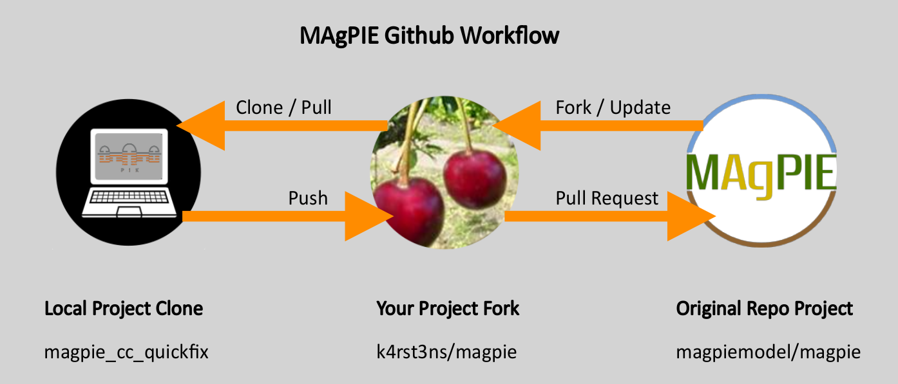
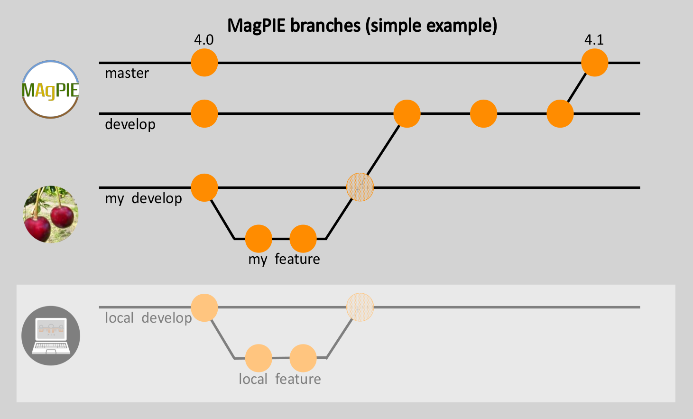
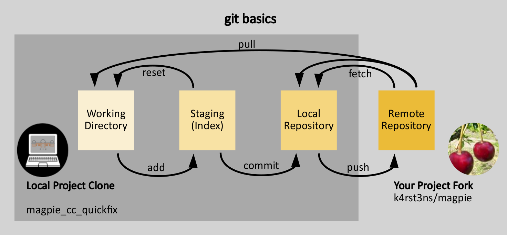

# Introduction

MAgPIE is published as open source software on GitHub. Hence we invite
all interested people to understand but also develop the code. Since
there are various workflows, how to use GitHub for collaborative
software development, we want to give some general remarks on our
prefered one. Note the following:

  - **Git** is a free and open source distributed version control system
    designed to handle everything from small to very large projects with
    speed and efficiency (from: <https://git-scm.com/> - very good help,
    documentation, tutorial page for git).

  - **GitHub** is an American company (owned by Microsoft) that provides
    hosting for software development version control using Git. (GitLab,
    SourceForge and various more are open-source alternatives to
    GitHub.)

# GitHub workflow for magpiemodel

Every code development (even bugfixes) will be merged into our main
repository under <https://github.com/magpiemodel/magpie> with the help
of so called pull requests. Pull request gives us control over the
changes entering our branches. To create a pull request, we use personal
or institutional forks. They have to be kept up-to-date with our
upstream repository (the original magpiemodel fork).

> **Exercise**: Visit us on <https://github.com/magpiemodel/magpie> and
> create your own fork by clicking at ‘fork’ (at the upper right).

It is basically possible to change the code just using the GitHub
interface, but since you want to test and run your code locally you have
to clone the repository from your fork anyway. This can be done using
the ‘https’ or ‘ssh’ adress of your fork together with the `git clone`
command (cmd/bash/GUI) at your machine. We recommend to upload an
ssh-key and use ssh to connect to GitHub.

> **Exercise**: Visit your fork and clone the repository at your
> machine.

To keep your fork up-to-date with the upstream repository you can use
the GitHub interface. Via `Fetch upstream` you are able to check if the
upstream is some commits ahead and, if so, merge this new changes into
your fork. If you feel familiar with git, you also can do this merging
procedure by adding both your fork and the upstream repository as so
called ‘remotes’ to your local repository.

> **Exercise**: Check, if there is anything to merge from the upstream
> repository into your fork. If so, merge it into your fork.

## Zoo of branches

To start new developments we create feature branches to keep the develop
branch clean. In the following figure you can see a simple example for
branches and their relationships.

  - The master branch of the upstream repository will be created by the
    magpiemodel team after accumulation of new developments in the
    develop branch. Please do not try to create a pull request directly
    to the master branch when you are not 100% sure, that you have a
    urgent hotfix.
  - The develop branch is the basis for new developments. Create a
    feature branch at your project fork to start your feature.
  - After you have finished your development by creating some commits,
    you merge your work via a pull request back to the develop branch of
    the upstream repository. You can merge your changes before into your
    develop and start a pull request from there or your directly create
    it from your feature branch.
  - The work itself will be done at your local project clone and will be
    pushed into your project fork. Basic commands for the interaction
    between your magpie fork and the local working copy can be found in
    the next section.

# Start to commit yourself

When you start making your first changes to the code at your local copy,
we strongly recommend to do a tutorial to get familiar with the basic
commands in git. You can also have a look on ‘git cheat sheets’ like
<https://about.gitlab.com/images/press/git-cheat-sheet.pdf>.

Here we just want to draw your attention to: - the branching workflow,
we kindly ask you to use and - the various working areas of the git
workflow.

Git wil help you not only to push changes to your remote repositories to
version control them, you will also locally control your development
steps:

  - When you introduce changes at your working directory, you can mark
    your changes by `git add`-ing them to your ‘staging area’.

  - After you have collected all your changes for your next commit, you
    will `git commit` them to your local version history.

  - When you `git push` your changes to your remote repository, you will
    see them finally at your forks GitHub-page.

  - Now you can do a `pull request`.

# References to learn more

  - <https://education.github.com/git-cheat-sheet-education.pdf>
  - <https://git-scm.com/book/en/v2>
  - <https://guides.github.com/activities/hello-world/>
  - <https://www.youtube.com/playlist?list=PLg7s6cbtAD15G8lNyoaYDuKZSKyJrgwB->
