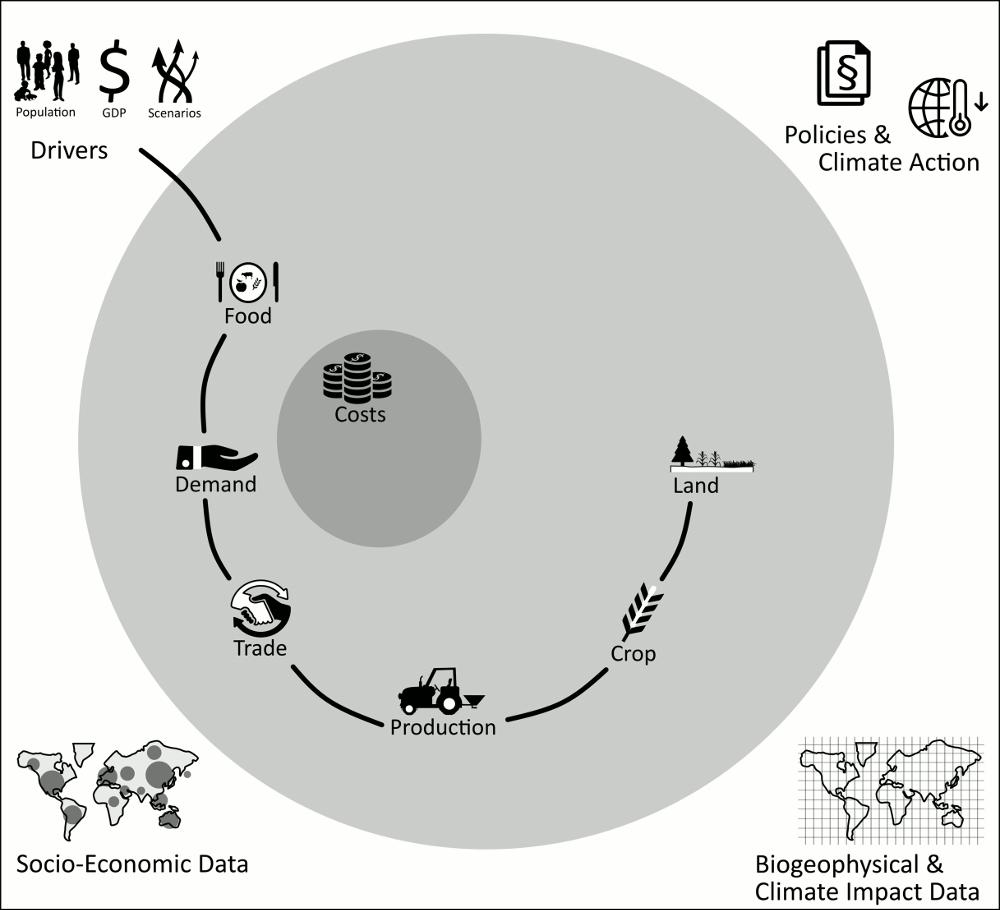
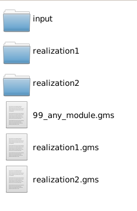

## Preface: Structure of the MAgPIE Model

MAgPIE (Model for Agricultural Production and its Impacts on the
Environment) is a modular open source framework for modeling global
land systems. Before looking into the code structure, we want you to
understand the basic dependencies of what we call ‘modules’. The full
interdependence and more detailed information can be found in our
[model documentation](https://rse.pik-potsdam.de/doc/magpie/4.4.0/)

Here, we want to shortly draw your attention to the ‘main line’ of
module interdependence:

- The future projections of population and GDP for given scenario
  assumptions represent the main drivers of the model.
- Food consumption patterns are derived based on the drivers and lead
  to a certain demand in primary products.
- Trade demand patterns are translated into production patterns.
- Production, with the help of biophysical yield data, is translated
  into cropping patterns that interact with land-use decisions.
- Note that these are not one-way dependencies. E.g. constraints in
  land availability can have implications on food consumption patterns
  due to rising food prices for different commodities.
- Associated costs are fed into the goal function of the cost
  module at the core of the model.
- Along with this ‘main line’ of agricultural production modules, the model
  includes additional:
    - assessments of impacts and policy interactions (upper part)
    - details of the production chain (lower part).

## Introduction

The inner core of the MAgPIE model is written in GAMS. For the model execution,
all parts of the code are put into a single file, the `full.gms`
(done automatically). The `modules` folder store all the blocks of the code.
Every folder within `modules` represents a component of the model and has
several realizations. The final model execution includes only one realization
of each module. The configuration settings that are set in `default.cfg`
(or inside the run start scripts) determine the realization entering the
`full.gms`.  

##  Structure of a module

When you open the `modules` folder, you see a long list of the individual
modules and the `include.gms` file that ensures the inclusion of all modules into the
`full.gms`. All modules are built similarly and follow the same structure:

  - An input folder with overarching input files for all realizations
  - Realization folders containing the source code of each realization
  - The `modules.gms` file with the module description and listing of all
    realizations
  - Several `[realization_name].gms` files with the realization description
    that links to the specific source code

New realizations can be added by keeping the same structure (more in
[this tutorial](7-advanced-changecode)). In that sense, MAgPIE is easily extendable.

### Structure within each realization

Within a realization, the source code is distributed over several
gms-files to ensure the correct order of calculations during the optimization.
Moreover, the interfaces for the model inputs and outputs are defined by this
structure. In the following table, you will see the purpose of each gms-file.
Note that not every gms-file is needed in every realization.

| gms.file         | function                                                                                                                             |
| :--------------- | :----------------------------------------------------------------------------------------------------------------------------------- |
| declarations.gms | Declares all variables, equations, and parameters that are central to the realization.                                                  |
| equations.gms    | Contains functional relationships that have to be fulfilled within the optimization.                                                 |
| input.gms        | Loads input from `any_module/input` or `any_module/a_realization/input`                                                              |
| sets.gms         | Lists sets that are used (mainly) within this specific realization or are needed for interfaces defined within this realilzation     |
| preloop.gms      | Includes calculations to be executed before the model run.                                                                           |
| presolve.gms     | Includes calculations to be executed before each time step.                                                                          |
| postsolve.gms    | Includes calculations to be executed after each time step and defines output.                                                        |
| nl\_fix.gms      | Fixes non-linear behaviour to linear behavior.                                                                                       |
| nl\_release.gms  | Releases restrictions to linear behavior again.                                                                                      |
| scaling.gms         | Lists the expected order of magnitude of specific variables calculated in this model to improve the efficiency of the run|   
| not\_used.txt    | Lists interfaces (declared in other modules) that are not used within this realization, but that are in other realizations of the same module |

### Coding etiquette variable and parameter naming

The MAgPIE model structure is built upon the idea that every module
is autonomous and interacts through a **clearly defined
interface** with other modules. This reflects the idea that every module represents
a separate part of the model that could be represented in a simple or more
sophisticated manner without relying on other modules. In this sense,
realizations are replaceable within a module, since all realizations of a module
have to deliver/interact with the same interface variables.
This is ensured by defined rules for variable and parameter naming.

The following prefixes are used within the model code:

    q_ eQuations
    v_ Variables
    s_ Scalars
    f_ File parameters - these parameters contain data read from input file
    i_ Input parameters - influence the optimzation, but are not influenced by it
    p_ Processing parameters - influence optimization and are being influenced by it
    o_ Output parameters - influenced by optimization, but without effect on the optimization
    x_ eXtremely important output parameters - output parameters, that are necessary for the model to run properly (required by external postprocessing). They must not be removed.
    c_ switches from the config.gms - parameters, that are switches to choose different scenarios
    m_ Macros

The prefixes have to be extended in some cases by a second letter:

    ?m_ module-relevant object - This object is used by at least one module and the core code. (Changes related to this object have to be performed carefully).
    ?00_ (a 2-digit number) module-only object - This 2-digit number defines the module the object belongs to. This object is only used by the respective module. It makes sure that different modules do not contain the same object.

Note that sets are treated slightly differently: Instead of adding a
prefix, sets have a 2-digit number suffix (defining the number of the
module in which the set is exclusively used). If the set is used in more
than one module, it does not have any suffix.

In other cases, the prefixes are extended with a second letter to indicate details such as:

    ?c_ value for the Current timestep - necessary for constraints. Each *c_-object must have a time-dependent counterpart
    ?q_ parameter containing the values of an equation
    ?v_ parameter containing the values of a variable

Suffixes indicate the level of aggregation of an object:

    (no suffix) highest disaggregation available
    _(setname) aggregation over set
    _reg regional aggregation (exception)
    _glo global aggregation (exception)

### Workshop Material
You will find the slides used in the workshop [here](../assets/pdf/GAMScode.pdf).
