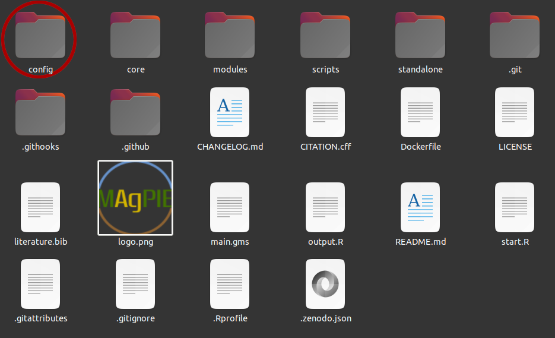
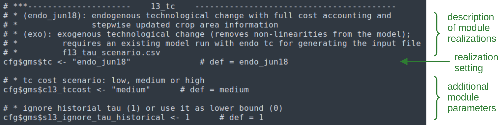

## Introduction

In computing, configuration files (or config files) are files used to
configure the parameters and initial settings for some computer
programs. In the MAgPIE context, a config file applies desired settings
to the model, e.g. specifying which module realizations or technical
model parameters to use. This file is read by MAgPIE just before starting a
model run.

The MAgPIE config file is written in R code, and can be modified using
any available text editor. In this tutorial, we will discuss how the 
MAgPIE config file is structured and how its content can be edited to 
run MAgPIE with updated settings.

Editing the config file by hand may be practical in cases where a user
is making one run at a time but more often than not, users may have to
work with a combination of different settings for the model. 
Therefore, in most cases start scripts are used, that automatically 
update MAgPIE settings before starting a model run. You will learn how to
[write your own start script](t06-startscript) in the next tutorial.

## The MAgPIE config file

### Location

It is expected that the participants of the workshop have already set-up a
MAgPIE clone \[1\] from the latest MAgPIE version available on GitHub \[2\].
The main model folder should contain the folders and files shown in the
following figure (note that depending on your settings for hidden files, 
folders and files starting with `.` might not be shown):



The MAgPIE config file is called **default.cfg** and located within the 
**config folder**. To open the MAgPIE config file follow the following
procedure:

1. Naviagte to the folder where you have cloned MAgPIE.
2. Look for the folder named **config**.
3. Within this **config** folder, look for the file **default.cfg**.
4. Right click on **default.cfg** file and open it with a text editor
of your choice.

The first few lines of **deafult.cfg** file should look like the
following (with licence text on top):

``` r
##################
#### SETTINGS ####
##################

cfg <- list()

#### Main settings ####

# short description of the actual run
cfg$title <- "default"

# path to the submodel to be used relative to main model folder
cfg$model <- "main.gms"   #def = "main.gms"

#### input settings ####

# which input data sets should be used?
cfg$input <- c(regional    = "rev4.65_h12_magpie.tgz",
               cellular    = "rev4.65_h12_1998ea10_cellularmagpie_c200_MRI-ESM2-0-ssp370_lpjml-8e6c5eb1.tgz",
               validation  = "rev4.65_h12_validation.tgz",
               additional  = "additional_data_rev4.07.tgz",
               calibration = "calibration_H12_sticky_feb18_free_30Nov21.tgz")
```

### Content of the config file

The config file includes all MAgPIE settings which are not fixed within the model.
This includes 

- metadata settings (e.g. the title of the model run)
- technical settings (e.g. the maximum number of iterations if precision goal is not met)
- module settings (e.g. which SSP scenario should be used for population projections)
- output and model reporting settings (e.g. which output scripts should be run)

These settings are collected as elements of a list called `cfg`.
The module settings (`cfg$gms$*`) make up the main part of the MAgPIE config file.
As MAgPIE is modular in structure, each module has its own section in the 
config file. Here, the module realization is chosen and additional module parameters
are set, as shown in the following figure for the *technological change (13_tc)* module.



The following table gives a description of core components from the MAgPIE config file.
Additionally, settings are also explained within the config file, by comments preceeding
the respective setting.

| No | Config               | Description                                                                           |
| -: | :------------------- | :------------------------------------------------------------------------------------ |
|  1 | cfg$title            | Model run title                                                                           |
|  2 | cfg$model            | Path to the submodel (relative to main model folder)                                  |
|  3 | cfg$input            | Input data source                                                                     |
|  4 | cfg$repositories     | Repository containing input data                                                      |
|  5 | cfg$force\_download  | Should data be downloaded even if inputs didn’t change?                               |
|  6 | cfg$force\_replace   | Should existing output folder be replaced if a new run with the same name is started? |
|  7 | cfg$recalibrate      | Yield calibration                                                                     |
|  8 | cfg$calib\_accuracy  | Accuracy for yield calibration                                                        |
|  9 | cfg$calib\_maxiter   | Max. iterations if precision goal is not met                                          |
| 10 | cfg$damping\_factor  | Factor determining new calibration factor’s influences on result                      |
| 11 | cfg$calib\_cropland  | Switch for cropland calibration                                                       |
| 12 | cfg$recalc\_npi\_ndc | Settings for NPI/NDC recalculation                                                    |
| 13 | cfg$policyregions    | National or Sub-national mapping                                                      |
| 14 | cfg$gms              | List of module settings                                                               |
| 15 | cfg$sequential       | How runs should be made                                                               |
| 16 | cfg$logoption        | Log information                                                                       |
| 17 | cfg$output           | Output scripts that should be used                                                    |
| 18 | cfg$results\_folder  | Results folder name                                                                   |
| 19 | cfg$files2export     | Files copied to output folder                                                         |
| 20 | cfg$runstatistics    | Folder run statistics location                                                        |
| 21 | cfg$model\_name      | Name of the overall model                                                             |
| 22 | cfg$model\_version   | Model version                                                                         |
| 23 | cfg$developer\_mode  | Developer mode                                                                        |
| 24 | cfg$debug            | Debugging mode                                                                        |


## Updating MAgPIE settings

Starting the MAgPIE model using the default start script as done in
the [previous tutorial](t04-start-run) will run the model using
the settings defined in the **default.cfg** file.

As suggested by the file name, in general all settings in the config 
file are set to default values. Typically, the **default.cfg** file is
not directly edited, but settings are changed using a start script, which
will be explained in the [next tutorial](t06-startscript). 
However, one can also update the MAgPIE config file by hand to start a
specific MAgPIE run.

In this tutorial we will change three settings (the title, the time steps
that are used, and the outputs that are generated), before running the
model with the updated settings.

### Changing the title

Let us try to see what the default title of MAgPIE runs is. This can be
seen by looking for the following text in the default.cfg file (line 17):

``` r
cfg$title
```

As you can see, the model is titled *default* for obvious reasons. You can 
now easily change the title of the model run by exchanging "default" (line 17) 
by a title of your choice:

``` r
cfg$title <- "titleOfYourChoice"
```

Usually the **title** setting helps in creating the name of the
**results** folder inside the **output** folder of the model. You can
see this setting by searching for `cfg$results_folder` in default.cfg file
(line 1490):

``` r
cfg$results_folder <- "output/:title::date:"
```

This tells us that the results from a MAgPIE run are
stored within the **output** folder where another sub-folder is created
automatically for each run. The name of this *results folder* is a
combination of **model title** and the **current date**. Usually you can
use any character string for the results folder name but it is important
to remember that if a result folder by the same name already exists,
the model execution stops (if `cfg$force_replace <- FALSE`) or earlier 
model outputs are replaced (if `cfg$force_replace <- TRUE`).

> Exercise 1: By editing the corresponding setting in the default.cfg file, change the 
  title of the model run to contain your affiliation (e.g. \"magWorkshop_PIK\").
  

### Changing the time steps

MAgPIE, being a recursive dynamic model, can run with various levels of
time steps. These time steps are usually in five year time intervals but you can
also run MAgPIE with ten year time steps (or a combination thereof).


Current time step setting can be found by looking for the following text
in the deafult.cfg file (line 123):

``` r
cfg$gms$c_timesteps
```

The default set of time steps is called “*coup2100*” and refers to time steps 
y1995, y2000, y2005, y2010, y2015, y2020, y2025, y2030, y2035, y2040, y2045, 
y2050, y2055, y2060, y2070, y2080, y2090 and y2100.

The full set of possible **time step settings** can be found in the core sets
defined in the model code under **core/sets.gms** (lines 182--211).

Similar to how we updated the title, you can simply delete the default 
set “coup2100” from the line containing

``` r
cfg$gms$c_timesteps <- "coup2100"
```

and set it to any other time steps option defined in **core/sets.gms**, e.g.

``` r
cfg$gms$c_timesteps <- "quicktest"
```

> Exercise 2: By editing the corresponding setting in the default.cfg file,
change the model time steps to the set \"quicktest\".
  
> Question: If you start a MAgPIE run with `"quicktest"` as time steps 
setting, which years would be included?

### Changing the ouputs generated

MAgPIE is also capable of generating some stylized outputs which can be
created automatically once the model run is finished. To see the current
output generation settings, look for the following text in the
default.cfg file (line 1484):

``` r
cfg$output
```

These ouputs can be based on **single** run of the model or can
also be **comparative** in nature where the comparison is made between
two or more runs.

The default MAgPIE configuration runs the following scripts after a model
run is finished:

- **output\_check** (check a MAgPIE output gdx file for known problems)
- **rds\_report** (to be used in appResults)
- **validation\_short** (creating a pdf of main results and validation data)
- **extra/disaggregation** (interpolates land pools to a finer resolution) 

All available output R scripts can be found in the MAgPIE model folder 
under **scripts/output**.

Usually, the creation of the validation pdf takes quite some time, generating 
a pdf file of about 1500 pages, and is therefore sometimes excluded from 
the output scripts that should be run. To change which output scripts should or
should not be run, you can simply add or remove the corresponding script 
name to the setting, e.g.

``` r
cfg$output <- c("output_check", "rds_report", "extra/disaggregation")
```
> Exercise 3: By editing the corresponding setting in the default.cfg file, 
  change the model configuration such that only the output script \"output_check\"
  is run.

## Running the model with updated configuration

So far, we have successfully changed:

1. Title of MAgPIE runs
2. Time steps of simulation
3. Outputs desired

Now, lets try to run the model with this updated configuration.

To do so, open a terminal (cmd for Windows, shell for Linux, MacOS) 
in the main folder of your local MAgPIE clone, and execute the following command:

``` r
Rscript start.R
```

You will now see a bunch of R scripts on your command prompt, based on
which the model can be run.

In order to start the run, select option 1 (***default***) to tell the
model that we want to make a default settings run (using the updated
default.cfg) and then option 1 again (***Direct execution***).

This will start the model run on your local machine (if you want to stop
the model run, use **crtl + c**).

> Exercise 4: Start a MAgPIE run using the updated model settings from
  exercises 1-3.
  
## Workshop Material
You can find the slides used in the workshop [here](../assets/pdf/UpdateModelSettings.pdf).

--------------------------------------------------------------

1.  **Cloning a repository**: <https://help.github.com/en/articles/cloning-a-repository>
2.  **MAgPIE repo**: <https://github.com/magpiemodel/magpie>