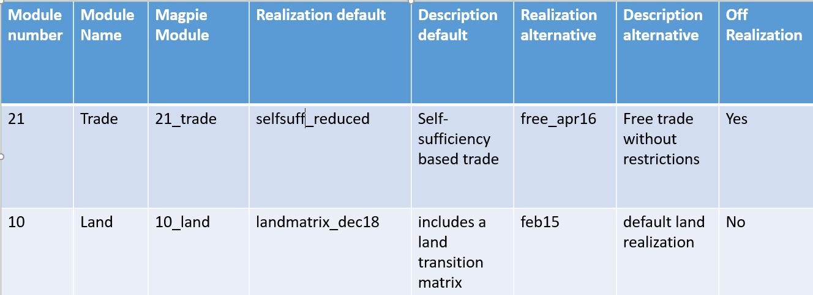

## Introduction

MAgPIE reads its specified configuration file just before starting a
model run. Editing these config files by hand (as we did in tutorial just before)
maybe practical in cases where a user is making one run at a time but more
often than not, users may have to work with a combination of different
settings for the model.

For example, a user may want to run two different food demand scenarios in
MAgPIE (free trade or selfsuff_reduced) and along with this, a user
may also want to run two different land scenarios (landmatrix_dec18 and feb15).
In this case, the total number of runs needed is 4. In
such cases, editing config files by hand is not advisable. Here, a good
programming practice would be to rather change these config files using
an R script which changes the config settings in an automatized manner.

With MAgPIE having a lot of modules and settings which can be changed
and used in various combinations, it becomes imperative that a user be
able to change a lot of settings concurrently. This can be achieved by
changing the config file (from tutorial 5) for turning on or off
module realizations and other settings.

## Getting started

Before we write our own starting script, it is important to know what a
start script really does. Let’s have a look at tutorial 4 again and see
the last part of the exercise where we started a model run. For this, we
first opened a command line prompt in the cloned MAgPIE folder and ran
the following command:

``` r
Rscript start.R
```

This operation calls the **start.R** script from the folder where MAgPIE
is cloned.

Then we selected option 1 (**default**) before making the model run.

The **start.R** script looks for the **start** folder located in the
**scripts** folder and displays all the R scripts contained inside.

Looking into the contents of **scripts/start** you’ll notice an R script
by the name of **default.R** which was used to carry out the operation
we selected earlier.

Let us have a look at the inner workings of this **default.R** script
before we write our own starting script.

## Structure of default start script

If you navigate to **scripts/start/default.R**, you’ll see that the
**default.R** script has the following structure: (you can open this
script in R or even in a plain-text editor).

``` r
######################################
#### Script to start a MAgPIE run ####
######################################

# Load start_run(cfg) function which is needed to start MAgPIE runs
source("scripts/start_functions.R")

#start MAgPIE run
start_run(cfg="default.cfg")
```

This is a basic script with no complex structure but let’s go through
this step-by-step. The first line is:

``` r
source("scripts/start_functions.R")
```

This tells the R environment to source **start\_functions.R** from the
**scripts** folder. Due to time constraints, we won’t look into what
start\_functions.R does but we just have to remember that this script
loads the config file and then loads start\_run function with this
config which is needed to start MAgPIE runs.

Moving forward, the second line is:

``` r
start_run(cfg="default.cfg")
```

The **start\_run()** function sourced from above is the used to start
the run using the settings specified in the **default.cfg** file.

## Writing our own start script

Before we start writing our own start script, let’s first discuss which
settings we’d like to change using this start script. For the sake of
simplicity, let’s just try to change two settings. We’ll make a total of
2\*2=4 MAgPIE runs with following changes:

1.  Making runs with two different **trade** module realizations.


2.  Making runs with two different **land** module realizations.


### Creating a start script from scratch

There are many ways in which you can initialize an R script that can be
used as a starting script. The easiest way however is to just make a
copy of one of the existing start scripts inside the **scripts/start**
folder.

For this, just copy the **default.R** script in **scripts/start** folder
and paste it within the same folder. Now rename this copied file to a
name of your liking. For this workshop’s purpose, let’s call is
**magpie\_workshop.R**.

As **magpie\_workshop.R** is just a renamed version of **default.R**,
the contents are the same and we’ll now start making changes to this
**magpie\_workshop.R** script. Users are now requested to open this
**magpie\_workshop.R** script in R or in a text editor of their choice.

The contents should look like this:

``` r
# ------------------------------------------------
# description: start run with default.cfg settings
# position: 1
# ------------------------------------------------

# Load start_run(cfg) function which is needed to start MAgPIE runs
source("scripts/start_functions.R")

#start MAgPIE run
start_run(cfg="default.cfg")
```

### Importance of documenting your code/script

At this point, we’d like to emphasize upon the importance of code
documentation and comments within the code.

The comments in your code would help you communicate to another user
what your script is trying to do and what a certain fragment of code
does. Not to mention that your future self will thank you for a well
documented/commented code. Always remember to add appropriate comments
to your code.

Imagine if the **default.R** script mentioned above looked like this:

``` r
source("scripts/start_functions.R")
start_run(cfg="default.cfg")
```

Without any background information and documentation/comments, it is
difficult to figure out what this piece of code is trying to do. Hence,
it is always a good practice to document your code appropriately.

Also remember that *code never lies, comments sometimes do*, so keep
your comments as accurate and precise as possible.

### Editing your start script

Now that we have the importance of documenting your code out of the way,
lets go back to writing our script.

As we still want to make changes to the **config** before starting a
run, lets delete/push the following line which starts the MAgPIE run,below. We
don’t need it for now (we’ll need it in the end):

``` r
#start MAgPIE run
start_run(cfg="default.cfg")
```

Your script should now look like this:

``` r
# ------------------------------------------------
# description: start run with default.cfg settings
# position: 1
# ------------------------------------------------

# Load start_run(cfg) function which is needed to start MAgPIE runs
source("scripts/start_functions.R")
```

Now, we’ll source the **default config** which you had changed in
tutorial 3. This loads the default.cfg file from the main folder and you can start
making changes to it. To do so, add the following line to your
script:

``` r
# Source the default config at this stage and then over-write it before starting the run.
source("config/default.cfg")
```

Remember that the above line just loads the object called **cfg** in R
environment. Contents of this **cfg** object can be found in Table 1
from tutorial 3.

Your script should now look like this:

``` r
# ------------------------------------------------
# description: start run with default.cfg settings
# position: 1
# ------------------------------------------------

# Load start_run(cfg) function which is needed to start MAgPIE runs
source("scripts/start_functions.R")

# Source the default config at this stage and then over-write it before starting the run.
source("config/default.cfg")
```

At this stage, when the script is called, it loads **start\_run()**
function and also loads the object **cfg** in R environment. Before
submitting the run with **start\_run()**, we’ll make changes to the
**default config** loaded in R environment.

#### Adding basic settings

Lets add some basic settings before moving to the main changes. These
changes would be made to the **cfg** object and we’ll use the notation
**cfg$\<some\_setting\>** for this purpose (Ref. Table 1 from tutorial 3
for details).

You can change the Description to give a sense of what this script does.
Go ahead and add the following lines in your **magpie\_workshop.R**
script:

``` r
# ------------------------------------------------
# description: Magpie workshop start script
# position: 1
# ------------------------------------------------

###########################################################
#### Some header which explains what this script does  ####
###########################################################

# Change results folder name
cfg$results_folder <- "output/:title:"

# Change time step settings
cfg$gms$c_timesteps <- 5

```

You’ll see that we had already changed these settings by hand in
tutorial 3. Here, these settings will be changed in **default config**
using the **magpie\_workshop.R** starting script which should look like
this now:

``` r

# ------------------------------------------------
# description: Magpie workshop start script
# position: 1
# ------------------------------------------------

###########################################################
#### Some header which explains what this script does  ####
###########################################################

# Load start_run(cfg) function which is needed to start MAgPIE runs
source("scripts/start_functions.R")

# Source the default config at this stage and then over-write it before starting the run.
source("config/default.cfg")

# Change results folder name
cfg$results_folder <- "output/:title:"

# Change time step settings
cfg$gms$c_timesteps <- 5

```

#### Adding loop(s)

We’ll now write a loop to go over the different combinations of module
realizations. As stated earlier, we’ll make 4 runs with changes to
trade module and land module. Figure 1 describes and explains the
available module realizations for these two modules.



The loop we write should change the config based on which module
realization we choose. Here, lets try making runs with the following
combinations:

1.  Trade default + Land default
2.  Trade default + Land alt
3.  Trade alt + Land default
4.  Trade alt + Land alt

To do so, the loop should go two times over trade module realizations
and then for each of theses instances, two times over the land
module realizations. In principle, this loop’s general structure should
look like this:

``` r
for(trade_setting in c("default_trade","alt_trade")){

  for(land_setting in c("default_land","alt_land")){

    change_trade_module_realization   ## Updates cfg

    change_land_module_realization  ## Updates cfg

    change_title_according_to_run_setting

    ## cfg has been changed further at his stage, start the run
    start_the_run
  }
}
```

Hence our working loop should look like this (adding **start\_run** in
the loop which we deleted earlier):

``` r
# Starting trade loop
for(trade_setting  in c("selfsuff_reduced","free_apr16")){
  # Starting land loop
  for(land_setting  in c("landmatrix_dec18","feb15")){

    # Set trade realization
    cfg$gms$trade <- trade_setting

    # Set land realization
    cfg$gms$land <- land_setting

    # Changing title flags
    if(trade_setting  == "selfsuff_reduced") trade_flag="resTrade"
    if(trade_setting  == "free_apr16") trade_flag="freeTrade"
    if(land_setting  == "landmatrix_dec18") land_flag = "landmatrix"
    if(land_setting  == "feb15") land_flag = "baseland"

    # Updating default tile
    cfg$title<- paste0("MAgPIE","_",trade_flag,"_",land_flag)

    ## cfg has been changed further at his stage, start the run
    start_run(cfg=cfg)
  } # <- Closing land loop
} # <- Closing trade loop
```

The final **magpie\_workshop.R** script should look like this:

``` r
# ------------------------------------------------
# description: Magpie workshop start script
# position: 1
# ------------------------------------------------

###########################################################
#### Some header which explains what this script does  ####
###########################################################

# Load start_run(cfg) function which is needed to start MAgPIE runs
source("scripts/start_functions.R")

# Source the default config at this stage and then over-write it before starting the run.
source("config/default.cfg")

# Change results folder name
cfg$results_folder <- "output/:title:"

# Change time step settings
cfg$gms$c_timesteps <- 5

# Starting trade loop
for(trade_setting  in c("selfsuff_reduced","free_apr16")){
  # Starting land loop
  for(land_setting  in c("landmatrix_dec18","feb15")){

    # Set trade realization
    cfg$gms$trade <- trade_setting

    # Set land realization
    cfg$gms$land <- land_setting

    # Changing title flags
    if(trade_setting  == "selfsuff_reduced") trade_flag="resTrade"
    if(trade_setting  == "free_apr16") trade_flag="freeTrade"
    if(land_setting  == "landmatrix_dec18") land_flag = "landmatrix"
    if(land_setting  == "feb15") land_flag = "baseland"

    # Updating default tile
    cfg$title<- paste0("MAgPIE","_",trade_flag,"_",land_flag)

    ## cfg has been changed further at his stage, start the run
    start_run(cfg=cfg)
  } # <- Closing land loop
} # <- Closing trade loop
```

## Exercise
**Starting MAgPIE with custom R script**

So far, we have learned:


1.  How standard MAgPIE starting scripts work.


2.  How to write our own starting script.


Now that we have created our own **magpie\_workshop.R** starting script
in the folder **scripts/start**, we are ready to test our script and
make a MAgPIE run.

To do so, windows users can go to the folder where MAgPIE was cloned and
open a command line prompt there. For windows users, this can be done by
typing **cmd** or **powershell** at the address bar of the folder where
MAgPIE was cloned and then pressing return/enter.

For mac users (if right click -\> open terminal setting is not enabled),
Head into System Preferences and select Keyboard \> Shortcuts \>
Services. Find “New Terminal at Folder” in the settings and click the
box. Now, when you’re in Finder, just right-click a folder and you’re
shown the open to open Terminal.

In the command prompt (or powershell or terminal) you just opened, use
the following command:

``` r
Rscript start.R
```

You’ll now see a bunch of R scripts on your command prompt, based on
which the model can be run.

We will used recently created **magpie\_workshop.R** script which uses
**default.cfg** as starting settings and then changes these settings
automatically.

In order to start the run, Select option number corresponding to
**magpie\_workshop** to tell the model that we want to make runs
according to our custom start script and then option 1 again (***Direct
execution***).

This will start\[1\] the model run on your local machine.

1.  To stop a run you can use the key combination **ctrl** + **c** on
    windows machines.
