## Introduction

After having successfully started and accomplished a simulation run, the
next step is to evaluate the simulation results. In case you have not
yet conducted an own MAgPIE simulation or your simulation is still
running, you can download model runs produced for Mishra et al. (2021)
(<https://doi.org/10.5194/gmd-14-6467-2021>).
These runs were created with version 4.3.5 of the MAgPIE model
(<https://github.com/magpiemodel/magpie/tree/master>).
You can download these runs as tgz folder from Zenodo (choose the folder
``magpie_v4.3.5_gmd-2021-76.tgz`` at <https://zenodo.org/record/5417474#.YeAf8_DMJaQ>)
and copy the folders containing the simulation
results into the *output* folder of your local version of the MAgPIE
model (Note: if you freshly cloned the model and did not set up a run yet, you
will have to create an empty output folder first).

There are several ways to assess and evaluate MAgPIE results. This
tutorial gives an overview on different tools and options that can be
used to analyse model outputs.

For each simulation, results are written into a subfolder of the *output* folder.
This subfolder is created automatically. Its name is a combination of the
model title and date. This is defined in the *default.cfg*
(``cfg$results_folder <- "output/:title::date:"``).


## Model-internal R-scripts for output analysis

# Manual execution of model-internal R-scripts
There are several output scripts that can be executed after the model run has
finished. These R scripts can be found in the folder *scripts/output*.
They can be selected and executed via the command window.
To do so, windows users can open a command
line prompt in the MAgPIE model folder by using **shift** + **rightClick** and
then selecting **open command window here** option.

In the command prompt, use the following command:

``` r
Rscript output.R
```

You are now asked to choose the simulation run for which you would like to
execute an output script.

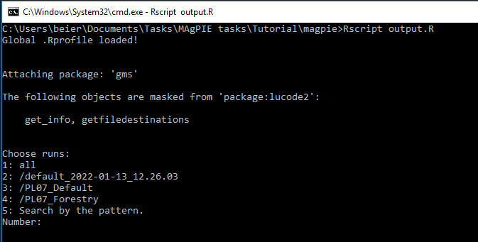

Next, you can choose which output scripts you want to execute:

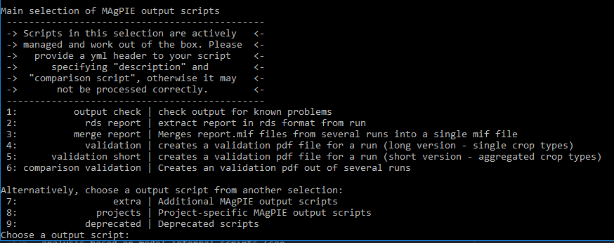

The last step is to select the run submission type, e.g. “Direct execution”:

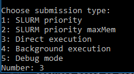

Now, the selected script will be executed. After completion, the results are
written in the respective folder of the simulation run inside the
*output* folder of the model.


# Model-internal R-script selection in the config file
In the file *config/default.cfg*, it is possible to specify which of these
output  R scripts are executed after a model run is finished.
In the default MAgPIE configuration, the scripts *output\_check*
*rds\_report* (to be used in appResultsLocal; see [below](#interactive-scenario-analysis)),
*validation\_short* and *extra/disaggregation* are selected via ``cfg$output``:

``` r
cfg$output <- c("output_check", "rds_report", "validation_short",
                "extra/disaggregation")
```


## Automated model validation

The automated model validation is an example of output
analysis based on model-internal scripts (see
[above](#model-internal-r-scripts-for-output-analysis)).
If the validation script is executed (either by selection via `cfg$output` as
explained [above](#model-internal-r-script-selection-in-the-config-file) or
by execution via the command window as explained
[above](#manual-execution-of-model-internal-r-scripts),
a standard evaluation PDF is created that validates numerous
model outputs with a validation database containing historical data and
projections for most outputs returned by the model, either visually or
via statistical tests. A standard evaluation PDF consists of hundreds of
evaluation outputs and usually has a length of around 1800 pages. By
evaluating the model outputs on such a broad level rather than focusing
only on key outputs, it allows getting a more complete picture of the
corresponding simulation. As an example of such validation files, you
can download the evaluation documents produced for all runs shown in the
MAgPIE 4 framework paper (<https://doi.org/10.5281/zenodo.1485303>)
or run the "validation" or "validation_short" output scripts as explained above.

The table of contents of the validation PDF gives a good overview over
the model outputs that can be simulated with a MAgPIE standard
simulation, even though the validation PDF only shows a subset of
possible model outputs:

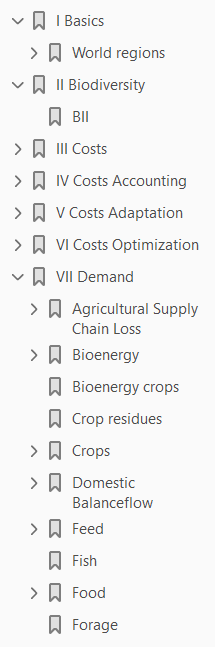

## Interactive scenario analysis

The automated model validation PDF is a good tool for visually
evaluating a broad range of model outputs. However, comparison between
model runs, i.e. between different scenarios, is rather difficult and
inconvenient with the different model results being scattered across
different large PDF files.

To overcome this issue, we developed the interactive scenario analysis
and evaluation tools appResultsLocal (and appResults for the use within
the PIK network) as part of the library ``shinyresults``
(<https://github.com/pik-piam/shinyresults>). It facilitates the evaluation of
results with plots for multiple scenarios including historical data and other
projections based on an interactive selection of regions and variables.
You can use this tool by running the following R command in the main
folder of your model, which will automatically collect all runs in the
output folder and visualize them:

``` r
shinyresults::appResultsLocal()
```

This command opens an interactive window, where you can select the
simulations that you want to
evaluate.

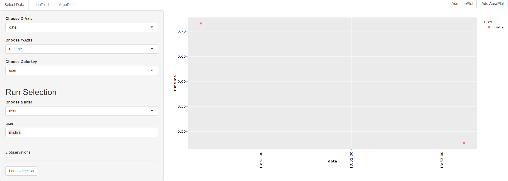

You can use filters to select a subset of all runs stored in the output
folder of the model, for example by searching for runs that have been
finished at a certain day, have been created by a certain user
or by searching for keywords in the title of the simulation runs:

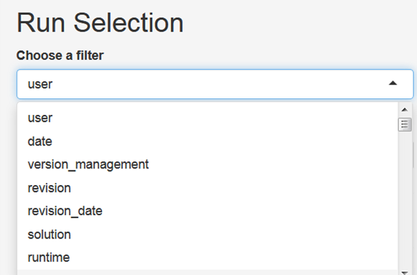


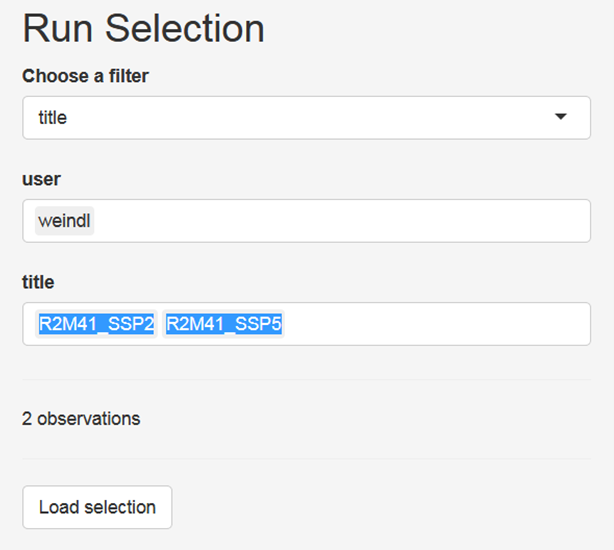

After having selected the subset of runs that you want to analyse, click
the button *Load selection*. Now, you can click on the tab *LinePLot*.
You will then see on the right hand side line plots showing the
development of population for historical and future time steps for all
model regions and on the global
scale:

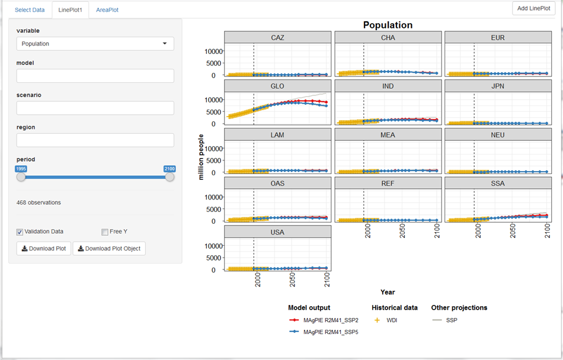

Now, choose a variable of your interest, either by scrolling through the
drop-down menu or write a key word in the input field, e.g. “cropland”,
to reduce the options in the
menu.

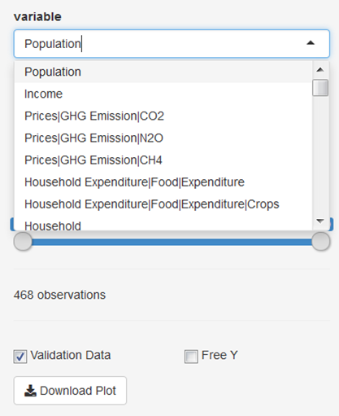

Make yourself familiar with the features of the app\! You can, for
example, select a subset of regions or a subset of time steps for which
the results should be plotted. Moreover, you can free the y-axis,
include or exclude validation data (if available) and download the plot.

## Analysis of outputs with the magpie4 library

If you want to go beyond visual output analysis and predefined output
evaluation facilitated by scripts, you can use
the functionality of the R package **magpie4**
(<https://github.com/pik-piam/magpie4>). This library contains a list of
functions for extracting outputs from the MAgPIE model, which are
also the basis for the generation of the automated validation PDF. For a
quick overview of the functions included in the library, you
can have a look in the folder **magpie4/R**. The following figure shows
a subset of R-files included in
**magpie4/R**:

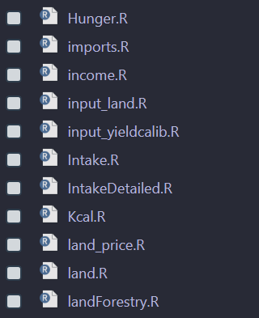

To make yourself familiar with this library, you can open an R/RStudio
session and set the MAgPIE model folder as working directory. This can
be done by using the following command:

``` r
setwd("/path/to/your/magpie/model/folder")
```

Then, load the library and call the help pages:

``` r
library(magpie4)
?magpie4
```

You can click on the index and search for interesting functions, e.g.
**carbonstock**, and read the respective help
page:

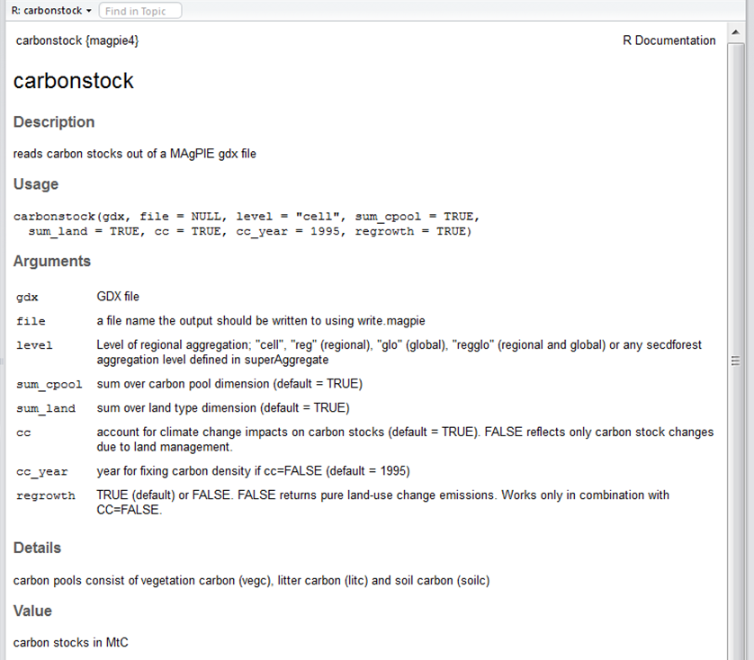


## Analyzing outputs with the gdx library

The **gdx library** (<https://github.com/pik-piam/gdx>) allows to
directly access objects contained in the *fulldata.gdx* file via the
function ``readGDX``. A pragmatic way to learn how to use this function
for the extraction of interesting information from the *fulldata.gdx* is
to open R files of the **magpie4** library within Rstudio. Most of the
magpie4 functions make use of ``readGDX``.

In the function ``magpie4::carbonstock()``, we see several
instances where ``gdx::readGDX`` is used,
e.g.:

``` r
a <- readGDX(gdx, "ov_carbon_stock", select=list(type = "level"), react = "silent")
sm_cc_carbon <- readGDX(gdx, "sm_cc_carbon2", react = "silent")
ov_land <- readGDX(gdx, "ov_land", select = list(type = "level"))
fm_carbon_density <- readGDX(gdx, "fm_carbon_density")[,t,]
```

It is possible to extract various GAMS objects like *“sets”*,
*“equations”*, *“parameters”*, *“variables”* and *“aliases”* with
``readGDX``.

With the argument ``select = list(type = “level”)``, you can select the level values
of endogenous variables, with ``select = list(type = “marginal”)`` you can
extract the marginal values of these variables.
