## Introduction

In the previous tutorial, we have learned how to analyse MAgPIE results at the regional scale. The next step, covered by this tutorial, is the analysis of spatially explicit output data at the 0.5 degree level. We therefore build on  knowledge covered by the previous tutorial on how to access the _output_ folder of your local MAgPIE version. If you are unsure, how to access the _output_ folder, or if you have not yet conducted a MAgPIE simulation, please, have a look at the previous tutorial(s).

MAgPIE itself does not operate at the 0.5 degree level, yet many procesess like land competition, agricultural production or irrigation are based on input data at the 0.5 degree grid cell level, which is aggregated to spatial simulation units (clusters) in order to address computational constraints.

## Disaggregation scripts

After optimisation, some of the model outputs can be disaggregated back to the 0.5 degree level via dedicated disaggregation scripts that can be found under `"<your MAgPIE folder>/scripts/output/extra"`. In the default MAgPIE configuration only the script `"extra/disaggregation"` is selected via ``cfg$output``:

``` r
cfg$output <- c("output_check", "rds_report", "validation_short",
                "extra/disaggregation")
```
However, other disaggregation scripts can be added by changing ``cfg$output`` _before_ conducting a model run, e.g. by adding `"extra/disaggregation_BII"`. In this example, we add spatially explicit projections at 0.5 degree for the _biodiversity intactness index_ (BII) to the _output_ folder.

``` r
cfg$output <- c("output_check", "rds_report", "validation_short",
                "extra/disaggregation", "extra/disaggregation_BII")
```

## Visualisation of spatially explicit MAgPIE output with the _Panoply NetCDF Data Viewer_

Spatially explicit MAgPIE output is usually stored in two different data formats in the _output_ folder, including the MAgPIE-own _magclass_-format with the ending '.mz' and the NetCDF format with the ending '.nc'. This section covers the handling and visualisation of spatial ouputs in the NetCDF format by using the NetCDF data visualisation tool _Panoply_. The _magclass_-format can be read-in and processed in R by using the R-packages `magclass` or `luplot` for visualisation. We will come back to this, however, at a later stage.

### Installling _Panoply_

In order to download _Panoply_ go to the website <https://www.giss.nasa.gov/tools/panoply/>. Scroll down until you find the header _Get Panoply_ and click on _Download Panoply_. This will lead you to the following page:

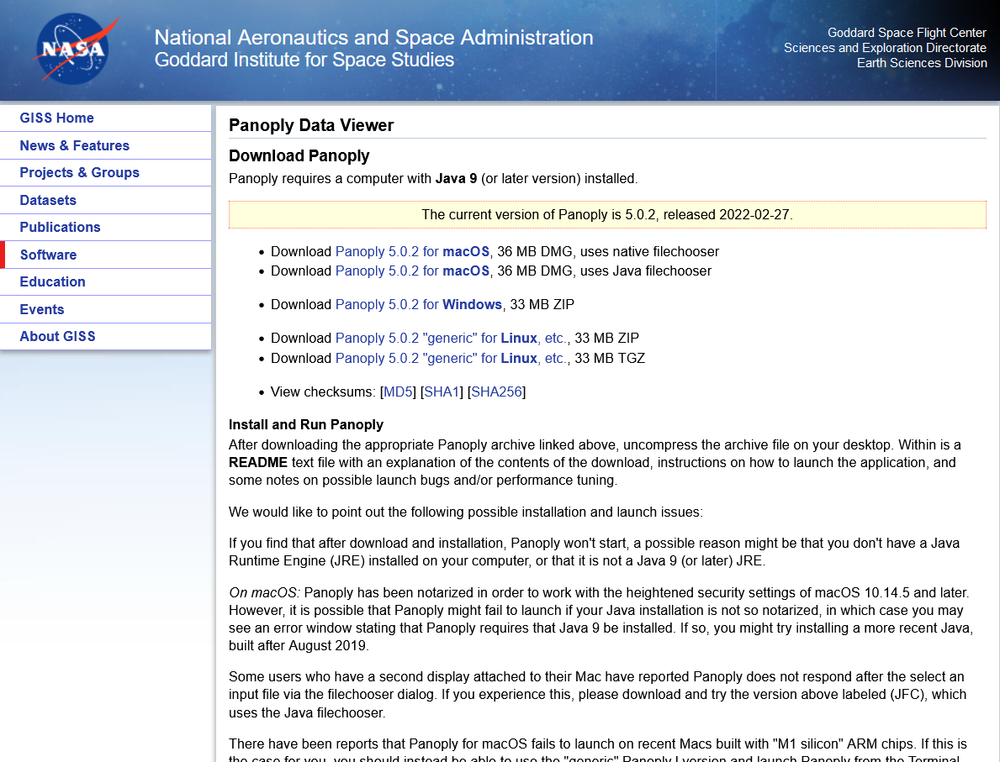

Please, choose the right version for your operation system, select a destination folder and proceed with the download. After the download has finished, follow the instructions for installing _Panoply_ that can be found on the website for your operating system.

### Make sure Java 9 (or later) is installed

If you encounter an error while trying to execute _Panoply_ after installation, make sure you have **Java 9 (or later)** available on your computer. In case you need to install/update _Java_, go to the website <https://www.oracle.com/java/technologies/downloads/#jdk17-windows> and download the appropriate version for your operating system.

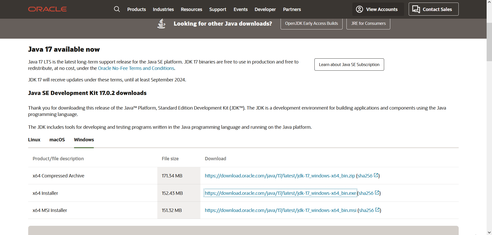

### Using _Panoply_ to visualise MAgPIE output

Navigate to the folder, in which _Panoply_ is stored and click on _Panoply.exe_ to execute the software. Each time a new session is started in _Panoply_, a new window opens that allows you to select your data. Navigate to the _output_ folder of your local MAgPIE version and select a subfolder containing the results of a succesful model run. _Panoply_ will display all NetCDF files that are available in this folder.

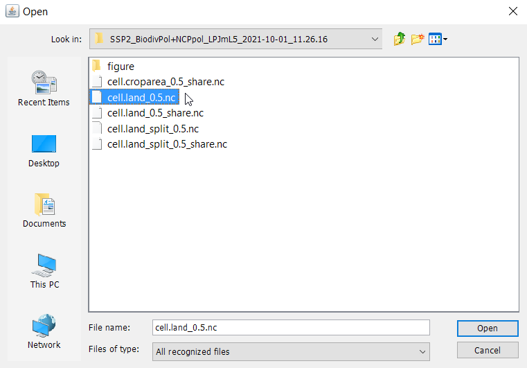

Select the file 'cell.land_0.5.nc' and press _open_. 'cell.land_0.5.nc' includes a spatially explicit time-series of the land area (Mha) covered by the different land-types (cropland, pasture, etc.) per 0.5 degree grid cell. We now see a window that lists all information that is stored in this file, including the names and the type of data that are available. We can also look at the panel on the right-hand side to see some meta data, e.g. the _units_.

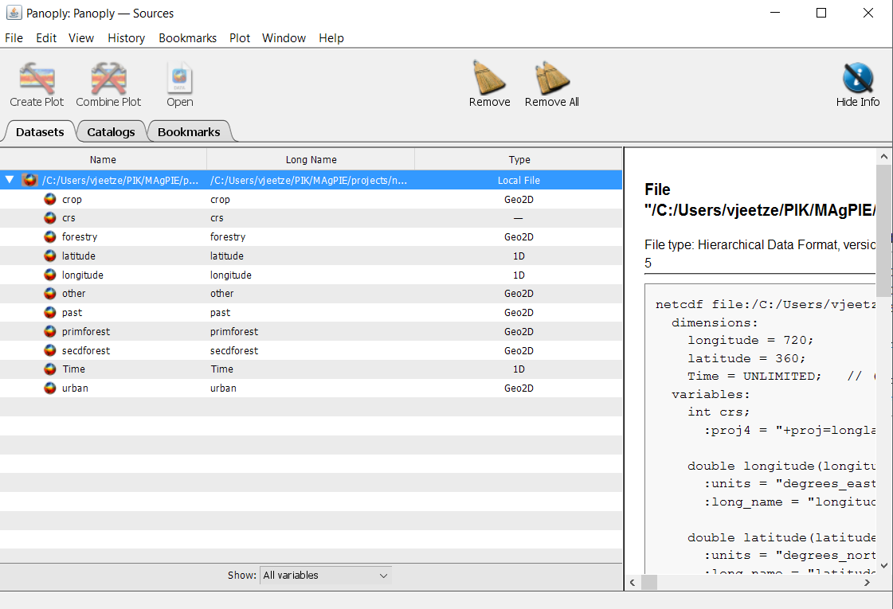

We can now select the item 'crop' by left-clicking it. Then click _Create Plot_, accept all defaults and press _Create_. This will create a plot similar to this example:

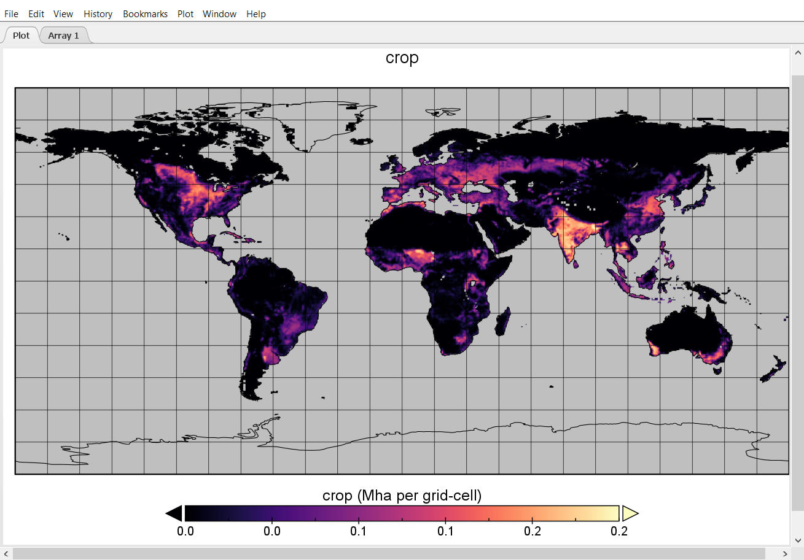

The plot shows the cropland area in each grid cell given in Mha. _Panoply_ also allows us to perform basic calculations and plot them. Now, let us compute the difference in cropland area per grid cell between the initial time step and 2050.

We go back to our data window and click on 'crop' once again.


But instead of pressing _Create plot_, this time we click on _Combine plot_. We now find two array tabs on the top left-hand side. Also, _Panoply_ will prompt the _Arrays_-window for us. Under _Plot_ select 'Array 2 - Array 1' and select the year 2050 in _Array 2: crop_, as shown below, and hit 'Enter'.

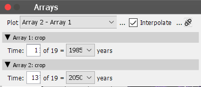

We can also change the appearance of the plot by reprojection the map to a different coordinate reference system (CRS), or by changing the color scale.

In order to change the CRS, we can open the window _Map Projection_ via

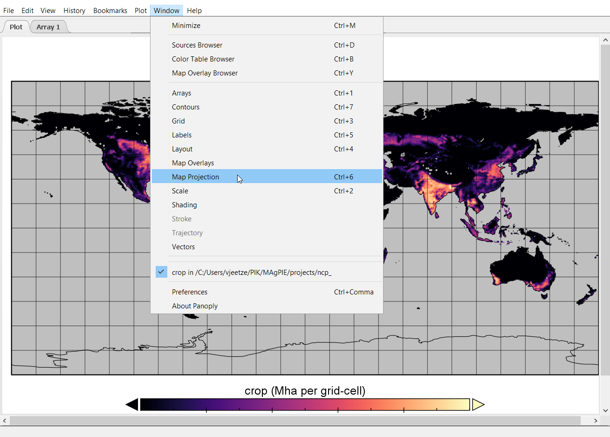

and then, for example, change to the 'Equal Earth' projection by clicking on the _Projection_ drop-down menu in the _Map projection_ window.

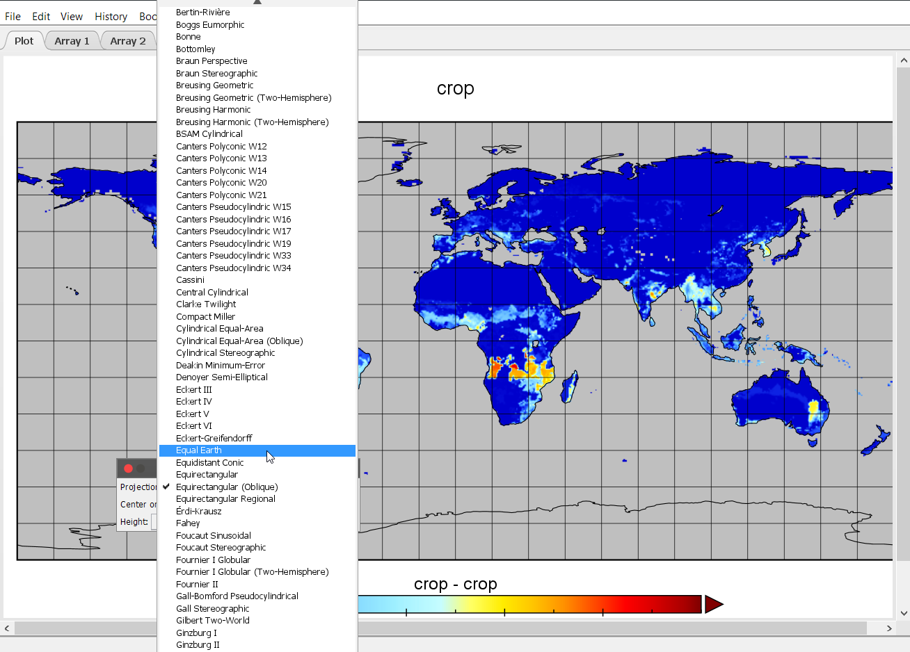

After changing the CRS, the map looks like this:

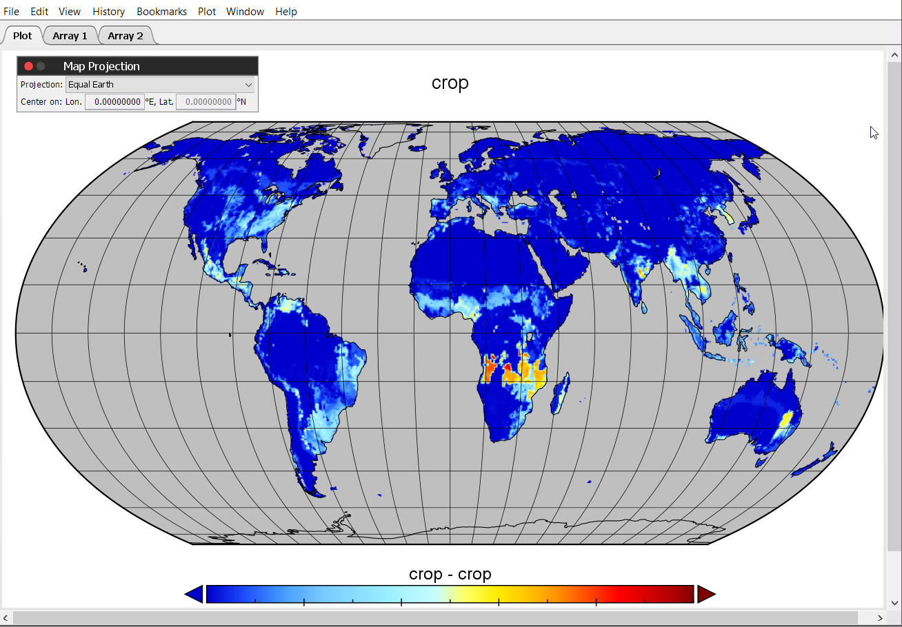

Now let us improve the looks of it a bit and work on the color scale. Therefore, select the option _Scale_ under _Window_.

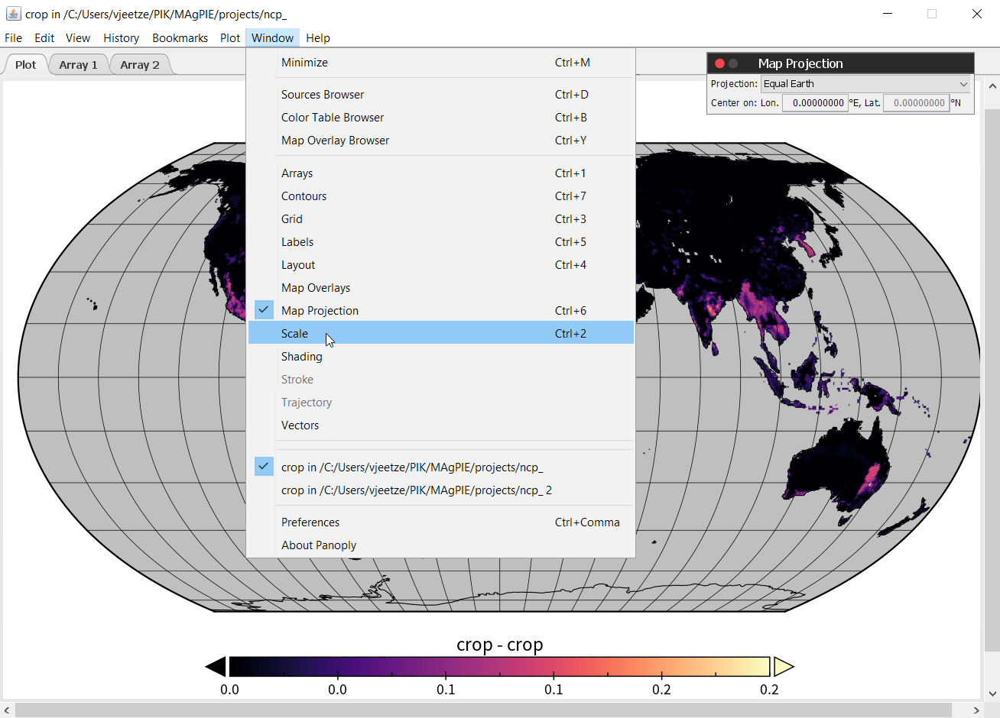

This will open the following window, where we can tweak a range of map properties.

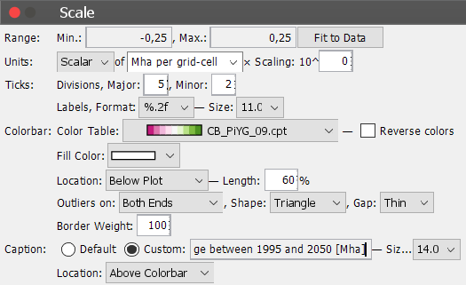

We can set the range of the legend to [-0.25; 0.25] and select the color bar 'CB_PiYG_09.cpt' or any color bar to your liking. However, consider that this is a change map and using a neutral color like grey or white in the center of your color range is recommended to facilitate the interpretation of the data. Also set the label format to '%.2f'. This will change the legend label format and provides us with two decimal places behind the comma. We can also add a custom caption by selecting _Custom_ and enter a suitable text. Under _Window_ -> _Label_ we can also change/remove global plot labels. In the end out plot looks like this:

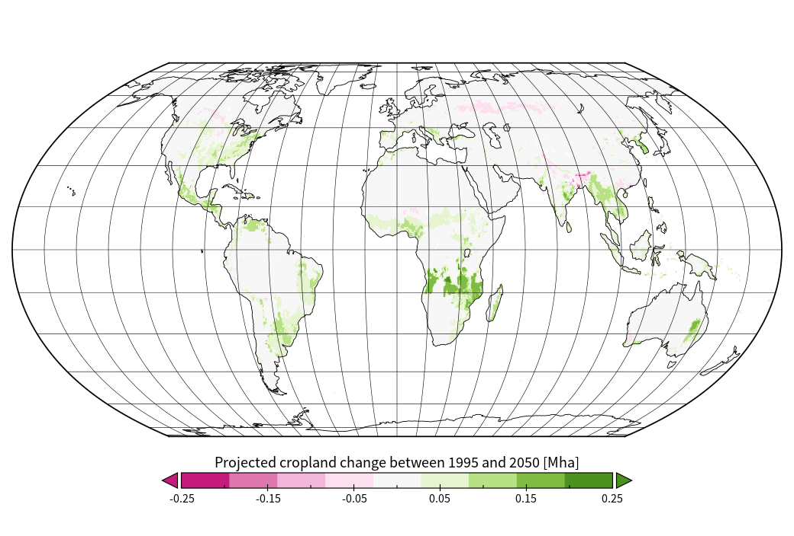

### Creating an animated time series based on MAgPIE projections using _Panoply_

_Panoply_ can also be used to create an animated time series (e.g. in MP4-format) based on spatially explicit MAgPIE projections. In the following, we will create an animated time series of changes in cropland area per grid cell, based on the map that we have created in the previous steps.

To create an animation go to _Export Animation_.

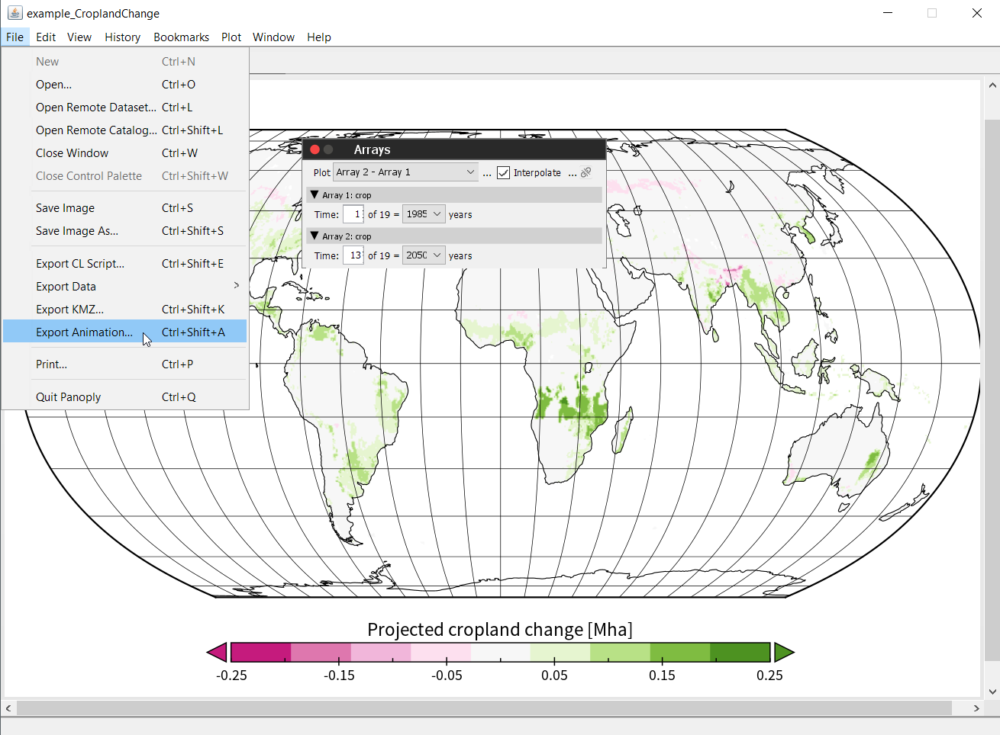

This will open up the following window:

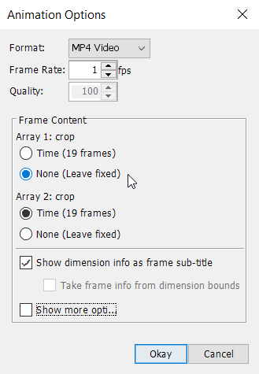

In order to display relative changes, set _Array 1: crop_ to 'None (leave fixed)' and select a frame rate of e.g. 1 fps, then click on _Okay_. Choose a file destination, choose a file name and press _Save_. _Panoply_ will now create an MP4-animation of the complete time series.

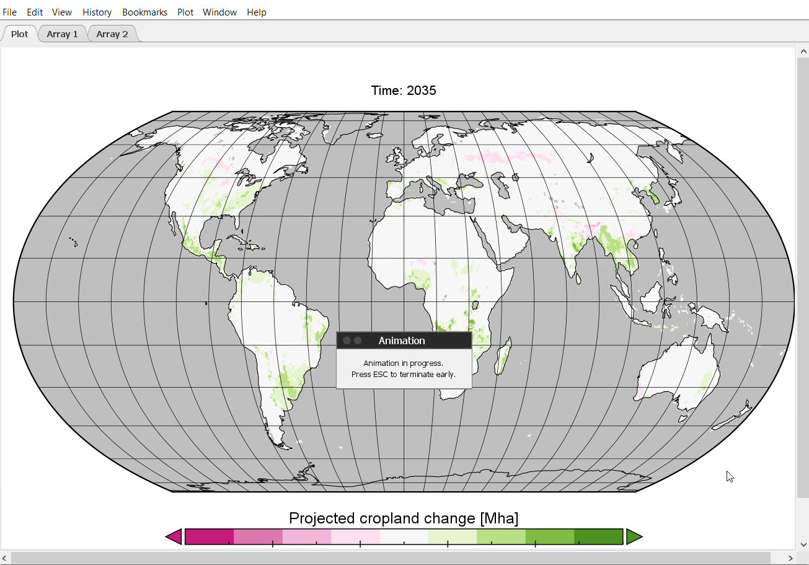

## Analysis of spatial outputs in R using the _magclass_ and _luplot_ libraries

For further analysis and processing of spatial MAgPIE projections beyond visual interpretation, spatial outputs can be imported and analysed in R using the packages `magclass` (<https://github.com/pik-piam/magclass>) and `luplot` (<https://github.com/pik-piam/luplot>). `magclass` provides a range of tools for handling MAgPIE's own _magclass_-format (ending '.mz') for storing spatio-temporal data. The `magclass` package also includes a vignette that describes the functionality of the package, including examples on how to handle spatio-temporal MAgPIE data.

We can make ourselves familiar with the `maglcass` package by opening an R (RStudio) session. Find the _output_ folder of your local MAgPIE version and set the working directory to the subfolder containing the results of a finished model run.

``` r
setwd("/path/to/your/magpie/output/subfolder")
```

We can call the library and look at the help pages:

``` r
library(magclass)
?magclass
```

In order to get an overview of the functionality, we can click on the index and look for helpful functions, e.g.
`read.magpie` and navigate to the help/documentation page, by clicking on it.

We can now try to read in 'cell.land_0.5.mz' by typing

``` r
x <- read.magpie('cell.land_0.5.mz')
```
Then we can use `str(x)` to find out how the data is structured in `x`. We can analyse `x` and perform a range of calculations. Data dimensions in `magclass` objects are indexed in the following three-dimensional form

```r
x['<cell>', '<time>', '<data>']
```
For example, we can compute the difference in the primary forest ('primforest') area in all grid cells between 2015 and 2050:

```r
primforestDiff <- x[,'y2050', 'primforest'] - x[,'y2015', 'primforest']
```
We can also compute the difference for all land classes simultaneously by typing

```r
allDiff <- x[,'y2050',] - x[,'y2015',]
```

Now, let us load the library `luplot` and look at the help pages:

``` r
library(luplot)
?luplot
```

The library contains helpful functions for plotting `magclass` objects in different ways, e.g. `plotmap` that transfers data stored in a `magclass` object to a simple map. However, we cannot plot all data at the same time. Therefore, we need to select a time step and a variable that we want to look at. Here, we choose the year `y2050` and the variable primary forest again. In `plotmap` can also define the upper and lower boundary of the legend via `legend_range`.

```r
luplot::plotmap(x[,'y2050', 'primforest'], legend_range = c(0, 0.3))
```

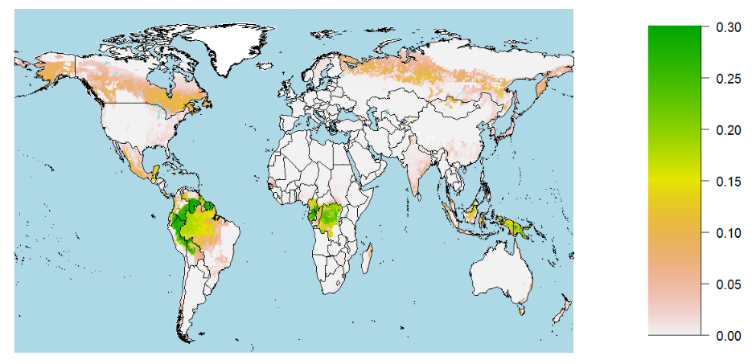
